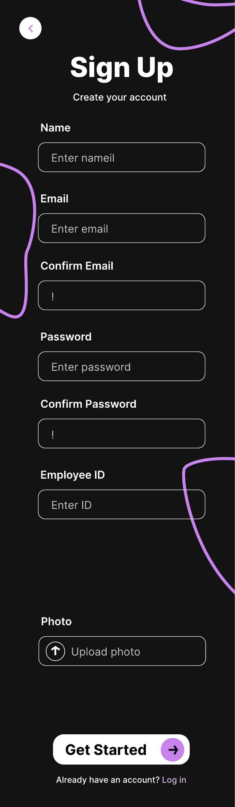
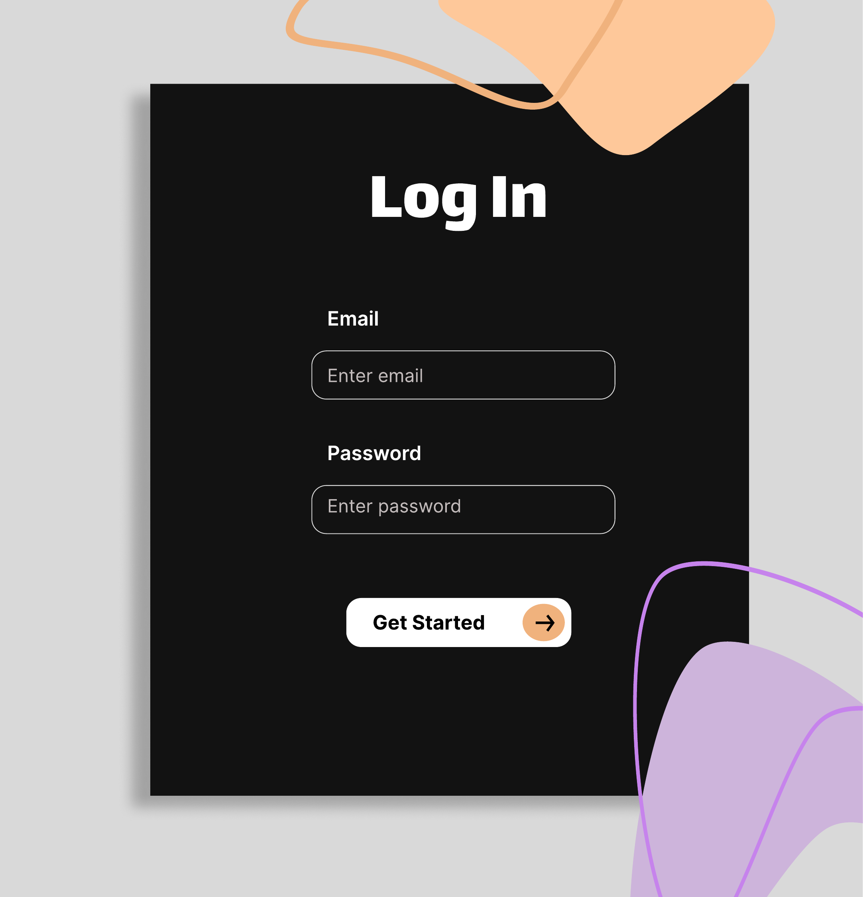
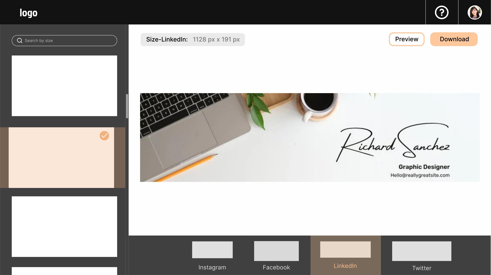
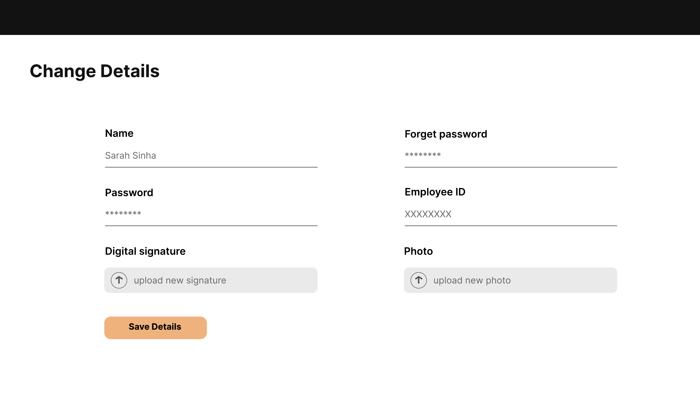

# Poster Maker — Frontend

[](https://react.dev/)
[](https://vitejs.dev/)
[](https://developer.mozilla.org/en-US/docs/Web/JavaScript)
[](https://netlify.com/)

> A branded poster generation portal for insurance advisors at Punjab Insurance Canada. Advisors log in, pick a template pre-sized for their target social platform, remove image backgrounds with AI, and download — no design tools needed.

**Backend Repo:** [Poster-maker-backend →](https://github.com/AbhayParasharhere/Poster-maker-backend)

---

## The Problem

Punjab Insurance advisors were manually creating promotional posters across separate tools and reformatting them for each social platform — inconsistent branding, wasted time, no standardization across agents. This app consolidates the entire workflow into one authenticated portal.

---

## Screenshots

### Authentication
| Sign Up | Log In |
|:---:|:---:|
|  |  |

### Core Flow
| Template Browser | Preview & Download |
|:---:|:---:|
|  |  |

### Profile Management


---

## Features

- **Advisor accounts** — sign up with name, email, employee ID, photo, and digital signature upload
- **Platform-sized templates** — browse and filter by Instagram, Facebook, LinkedIn, Twitter
- **AI background removal** — powered by `@imgly/background-removal`, runs client-side
- **Poster export** — download via `html2canvas` + `dom-to-image-more` at correct dimensions
- **Cookie-based auth** — JWT stored via `js-cookie`, persisted across sessions
- **Profile management** — update name, password, photo, and digital signature
- **Error handling** — `ErrorElement.jsx` for graceful fallback UI

---

## Tech Stack

| | |
|---|---|
| Framework | React 18 + Vite 4 |
| Routing | React Router DOM v6 |
| Background removal | `@imgly/background-removal` (client-side AI) |
| Poster export | `html2canvas` + `dom-to-image-more` |
| Auth | JWT + `js-cookie` |
| Loading states | `react-loader-spinner` |
| Deployment | Netlify |

---

## Project Structure
```
src/
├── LoginPage/            # Login flow
├── Signuppage/           # Signup with photo + signature upload
├── PosterSelectorPage/   # Template browser, platform size filter
├── DetailChangePage/     # Profile management (name, password, photo, signature)
├── Module/               # RemoveBG — AI background removal module
├── apis/                 # API call functions (axios/fetch wrappers)
├── assets/               # Static assets
├── App.jsx               # Route definitions
├── App.css               # Global styles
└── ErrorElement.jsx      # Error boundary fallback
```

---

## Local Setup

**Prerequisites:** Node.js 18+
```bash
# 1. Clone and install
git clone https://github.com/AbhayParasharhere/Poster-maker-frontend
cd Poster-maker-frontend
npm install

# 2. Point to your backend
# In vite.config.js, update the proxy target:
# proxy: { '/api': 'http://localhost:8000' }

# 3. Run
npm run dev
# → http://localhost:5173
```

---

## Scripts
```bash
npm run dev        # Dev server with HMR → localhost:5173
npm run build      # Production build → dist/
npm run preview    # Preview production build locally
npm run lint       # ESLint check
```

---

## Contributors

Built as a paid client engagement for **Punjab Insurance Agency Inc.** (Canada), alongside a companion [Training Portal](https://github.com/AbhayParasharhere/Poster-maker-backend).

| | GitHub |
|---|---|
| Abhay Parashar | [@AbhayParasharhere](https://github.com/AbhayParasharhere) |
| Abhi | [@abhi-rzoro](https://github.com/abhi-rzoro) |
| Naman Batra | [@nbatra752](https://github.com/nbatra752) |

---

## Related

| Repo | Description |
|---|---|
| [Poster-maker-backend](https://github.com/AbhayParasharhere/Poster-maker-backend) | Django REST API |
| [PowerCompass Pro](https://powercompasspro.com) | Multi-tenant SaaS CRM — flagship project |
